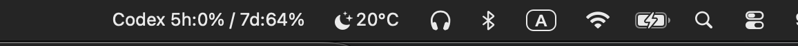
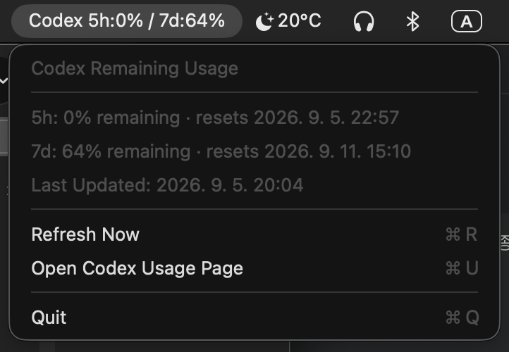

# CodexUsage

**macOS 메뉴바에서 OpenAI Codex의 남은 사용량을 간편하게 확인할 수 있는 경량 앱입니다.**

```text
Codex 5h:90% / 7d:37%
```

> **비공식 프로젝트** — CodexUsage는 OpenAI의 공식 제품이 아니며 OpenAI와 제휴하거나 공식적으로 지원받는 프로젝트가 아닙니다.


## Screenshots

### Menu Bar



### Usage Details




---

# 🇰🇷 한국어

## 주요 기능

- **5시간 / 7일** Codex 남은 사용량 표시
- macOS 메뉴바에서 바로 확인
- 30초마다 자동 갱신
- 가능한 경우 사용량 Reset 시간 표시
- 별도의 OpenAI API Key 불필요
- 별도의 로그인 불필요
- Swift 기반 네이티브 macOS 앱

표시되는 퍼센트는 **사용한 양이 아니라 남은 양**입니다.

```text
Codex 5h:90% / 7d:37%

5h:90% → 5시간 사용량 90% 남음
7d:37% → 7일 사용량 37% 남음
```

## 요구사항

- macOS 13 Ventura 이상
- OpenAI Codex CLI
- Codex CLI 로그인 완료

CodexUsage는 Mac에 저장된 Codex 데이터를 사용하므로 별도의 계정 로그인이 필요하지 않습니다.

## 설치

저장소를 Clone 합니다.

```bash
git clone https://github.com/apollo8900/CodexUsage.git
cd CodexUsage
```

빌드합니다.

```bash
./build.sh
```

실행합니다.

```bash
open CodexUsage.app
```

실행하면 macOS 메뉴바에 Codex 남은 사용량이 표시됩니다.

## 동작 방식

CodexUsage는 Codex CLI가 로컬에 기록한 최신 사용량 정보를 읽습니다.

```text
~/.codex/sessions/
```

사용량은 다음과 같이 계산합니다.

```text
남은 사용량 = 100 - 사용한 비율
```

CodexUsage는 **30초마다** 새로운 로컬 사용량 정보가 있는지 확인합니다.

OpenAI 서버에 30초마다 직접 요청하는 방식이 아니므로, Codex가 새로운 사용량 정보를 로컬에 기록하기 전까지 표시값이 변경되지 않을 수 있습니다.

## 개인정보 및 주의사항

CodexUsage는 로컬에서 동작하며 별도의 ChatGPT 비밀번호나 OpenAI API Key를 요구하지 않습니다.

Codex의 로컬 세션 파일에는 사용량 이외의 정보가 포함될 수 있으므로 다음 디렉터리의 파일을 GitHub 등에 공개하지 마세요.

```text
~/.codex/
```

Codex의 로컬 데이터 구조가 향후 변경되면 CodexUsage가 정상적으로 동작하지 않을 수 있습니다.

---

# 🇺🇸 English

## Features

- Shows remaining **5-hour / 7-day** Codex usage
- Displays usage directly in the macOS menu bar
- Automatically refreshes every 30 seconds
- Shows reset times when available
- No OpenAI API key required
- No additional login required
- Lightweight native macOS app written in Swift

The percentages represent **remaining usage**, not consumed usage.

```text
Codex 5h:90% / 7d:37%

5h:90% → 90% remaining in the 5-hour window
7d:37% → 37% remaining in the 7-day window
```

## Requirements

- macOS 13 Ventura or later
- OpenAI Codex CLI
- Signed in to Codex CLI

CodexUsage uses Codex data already stored on your Mac, so no additional account login is required.

## Installation

Clone the repository:

```bash
git clone https://github.com/apollo8900/CodexUsage.git
cd CodexUsage
```

Build:

```bash
./build.sh
```

Run:

```bash
open CodexUsage.app
```

Codex remaining usage will appear in your macOS menu bar.

## How It Works

CodexUsage reads the latest rate-limit information generated locally by Codex CLI from:

```text
~/.codex/sessions/
```

and calculates:

```text
remaining = 100 - used_percent
```

The app checks for updated local usage information every **30 seconds**.

It does **not** query OpenAI servers every 30 seconds. Values are updated when new usage information is written locally by Codex.

## Privacy & Notes

CodexUsage runs locally and does not require your ChatGPT password or OpenAI API key.

Codex session files may contain information other than usage statistics. Do not publish or commit your local Codex directory:

```text
~/.codex/
```

CodexUsage relies on Codex's current local data format. Future changes to Codex may affect compatibility.

---

## Disclaimer

CodexUsage is an **unofficial, independent open-source project**.

It is not affiliated with, endorsed by, or sponsored by OpenAI.

OpenAI, ChatGPT, Codex, and related names and trademarks belong to their respective owners.
